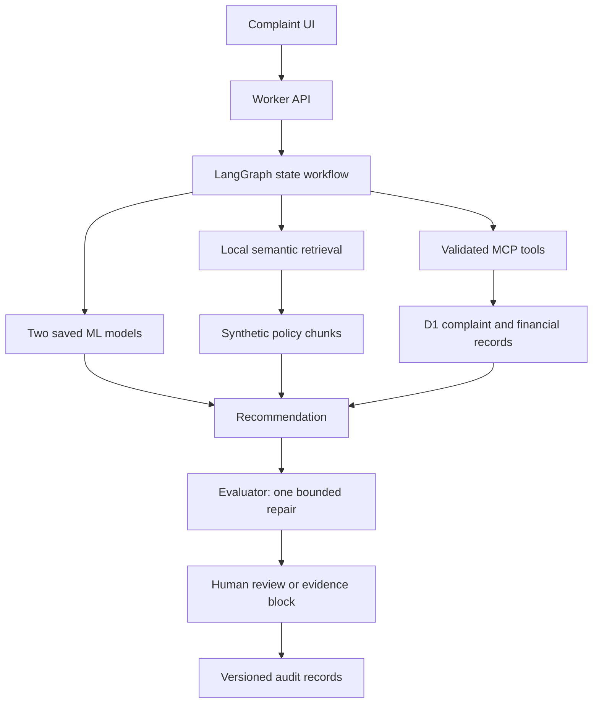

# Portfolio case study — OpsPilot

## Problem
A financial operations reviewer must reconcile disputed evidence before recommending an action. An opaque answer is insufficient.

## System and architecture

## Workflow, RAG and custom models
A flagship synthetic complaint links a customer, account and $1,250 transaction. The workflow retrieves policy excerpts, reads records, calls the real-data response-delay model and synthetic escalation forest, validates the policy recommendation and pauses for review. Local semantic inference requires no provider API. The two models have different targets and datasets and are never presented as interchangeable risk estimates.

## Evaluation and results
Financial regression: 30/30 cases. Expected decision match 100.0%; required citation coverage 100.0%; expected tool coverage 100.0%. These are deterministic policy regressions, not LLM accuracy or autonomous tool-choice scores. Mean local test latency 172.8 ms. Local semantic Recall@3 93.8%; MRR@6 0.869 on 24 labelled queries. Historical response-delay test F1 0.170, ROC-AUC 0.881. Synthetic escalation test F1 0.660, ROC-AUC 0.810; synthetic results do not establish real escalation performance. Local mode makes no provider calls; hosting costs excluded.

## Failure analysis and governance
Missing evidence blocks approval. Disputed evidence, vulnerability and fraud flags trigger specialist review. Low model precision, retrieval misses and synthetic-label limitations are visible. Original recommendations, edited replies, source references and versioned evidence are retained. The system never issues a payment.

## My contribution
Workflow orchestration, typed tool contracts, model integration, evaluation harness, casework experience, review concurrency, source packaging and deployment were developed with AI assistance. Python service and hosted Worker boundaries are documented. Cloud CI and Docker runtime verification remain pending.

## What I learned
A graph is only useful when its state and failures are inspectable. Retrieval metrics must be measured before policy supplementation. Synthetic labels can test integration but cannot substantiate real predictive capability. Honest model limitations and blocked actions are product behaviour, not footnotes.
