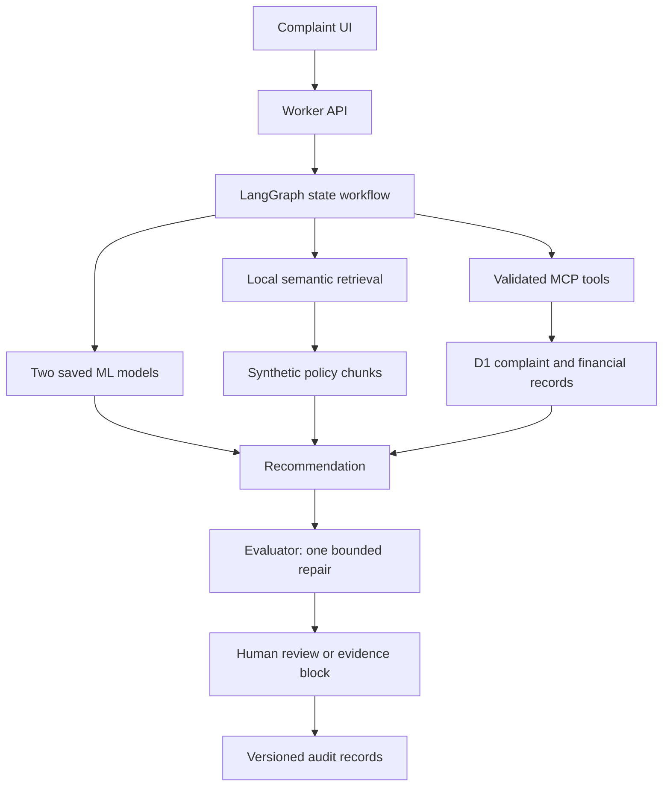

# OpsPilot
Evaluated financial complaint workflows with semantic retrieval, bounded tools, two saved ML models and human-controlled recommendations.

Built by Hanxi Li (Alex), with AI-assisted implementation.

[Live Demo](https://opspilot-evaluated-demo.alexis707199.chatgpt.site/) · [Architecture](#architecture) · [Evaluation Results](#evaluation-results) · [Design decisions](docs/design-decisions.md) · [Resume versions](docs/resume-bullets.md)

GitHub repository: https://github.com/Violet79-hub/OpsPilot. Source is also versioned in Sites. See GitHub Actions for the actual cloud verification status; local test reports are not proof of a cloud pass.

## Problem and why this project
Financial complaints combine incomplete evidence, disputed facts and asymmetric consequences. A reviewer needs an inspectable recommendation and an audit trail. OpsPilot demonstrates that workflow using synthetic business records, without issuing payments or contacting customers.

## Architecture


Actual hosted stack: React/Vinext, TypeScript LangGraph, Cloudflare Worker, D1, local static embeddings, portable scikit-learn model exports and a stateless MCP endpoint. Python FastAPI is a separate included service, not the hosted Worker. PostgreSQL, pgvector, Kubernetes and a hosted Python container are not required by the running Site and are not claimed as deployed.

## Demo guide
The initial HTML contains 12 synthetic cases with customer, transaction, account, amount, date, evidence and labelled prior history. Initial reviewed/review-pending statuses are synthetic fixtures, never fabricated user actions. Run Demo Case executes CP-101: Emma Chen disputes $1,250 while merchant and customer evidence conflict. The graph reads linked records, computes model signals, retrieves policy and escalates for a human. Missing evidence case CP-110 blocks approval. Five historical public CFPB replays remain separately labelled.

## Agent workflow and tool calling
Typed state contains plan, original retrieval results, tool outputs, financial records, model outputs, recommendation, evaluator checks, system version and timings. Nodes cover planning, retrieval, business tools, ML inference, answer and evaluation; approval is a subsequent atomic database transaction. The default plan and answer use deterministic policy logic. Provider-assisted planning/generation exists but has not been run with a real key. Do not describe default execution as autonomous LLM reasoning.

## RAG
A pinned Apache-2.0 pretrained static embedding table runs inside the Worker at 128 dimensions after per-token int8 quantization. WordPiece tokenization, normalized pooled embeddings, 1,600-character chunks with 200-character overlap and cosine ranking support English search. Evidence shows document ID, section, chunk ID, offsets, text and score. Exact authoritative policy lookup may supplement retrieval and is traced separately; it receives no credit in independent ranking metrics. This is a small in-memory vector search, not a deployed vector database. [Reproduction](docs/SEMANTIC_RETRIEVAL.md).

## Custom ML models
The historical response-delay classifier uses 20,000 real CFPB structured records and chronological 12,000/4,000/4,000 splits. Logistic regression was selected against alternatives using validation results. It predicts historical timely=No, not fraud or refund entitlement. Poor precision and unsupported-category abstention are displayed.

The separate escalation experiment uses 2,000 explicitly synthetic labelled examples with disjoint 1,200/400/400 splits. The label-generating mechanism is published in `ml/escalation/train.py`. Validation average precision selects Random Forest versus scaled Logistic Regression; validation selects the threshold. Saved joblib and JSON artifacts are checked against independent Python/TypeScript inference. These scores measure synthetic mechanism recovery only. Customer vulnerability and fraud flags come from fixtures, never inferred from identity. Both models are shadow-only and cannot authorise money movement.

## Evaluation results
Financial regression: 30/30 cases. Expected decision match 100.0%; required citation coverage 100.0%; expected tool coverage 100.0%. These are deterministic policy regressions, not LLM accuracy or autonomous tool-choice scores. Mean local test latency 172.8 ms. Local semantic Recall@3 93.8%; MRR@6 0.869 on 24 labelled queries. Historical response-delay test F1 0.170, ROC-AUC 0.881. Synthetic escalation test F1 0.660, ROC-AUC 0.810; synthetic results do not establish real escalation performance. Local mode makes no provider calls; hosting costs excluded.

All displayed metrics are derived by `scripts/benchmark-summary.py` from saved test executions. Run Evaluation in the Site for a new session-owned batch. Inspect per-case failures rather than a single aggregate score. Retrieval misses are independent of mandatory policy lookup. Citation coverage checks expected IDs, not full semantic entailment.

## Failure analysis
Persist failed execution states, missing records, unsupported ML inputs, citation checks and provider errors. Show the genuine held-out errors for both models and retrieval misses. Do not manufacture an LLM failure before live-provider execution exists. A failed evaluator can trigger one answer repair in live mode; further failure blocks approval.

## Human review and auditability
Reviewer edits are stored separately from the original generated/template answer. Approval/rejection and timestamps are recorded, with one action per run enforced transactionally. Evidence revisions invalidate old recommendations, and requests for information pause progress. Initial sample history is visibly distinct from new user actions. Session data is isolated via opaque HttpOnly cookies; it is not enterprise authentication.

## MCP
`POST /mcp` supports initialization, discovery and read-only tools: get_complaint, get_customer, get_transaction, get_account, predict_response_delay, predict_escalation_risk, search_company_policy and get_model_card. Linked business tools accept a case ID and validate access through that complaint. Sites supplies identity at the hosting boundary. The graph reuses the JSON-RPC dispatcher in process; SDK HTTP tests verify transport separately. The Python stdio server is a separate local example. Run `node tests/mcp.integration.mjs /path/to/backend/python` and `PYTHONPATH=backend /path/to/backend/python scripts/mcp_smoke.py`. A production plugin connection requires the user's connection step.

## Testing and local release pipeline
Install JavaScript dependencies with `bash scripts/install-pnpm.sh`. Install `backend/requirements.txt` and `ml/requirements.txt` in separate Python environments. Run:

```sh
python scripts/release-pipeline.py --backend-python /path/to/backend/python --model-python /path/to/model/python
```

The fail-fast pipeline runs ESLint, type checking, model parity and reproducibility, API/D1/LangGraph regressions, Python tests, client session initialization, retrieval evaluation, official MCP SDK checks, production build and compiled-Worker end-to-end checks. Logs and measured durations are in `verification/`. Browser visual interaction remains unverified where the required browser tooling is unavailable.

## CI/CD and Docker
`.github/workflows/verify.yml` runs the same gates plus a Docker build/start/health-check job when the source is placed in an authorised GitHub repository. It is configuration, not evidence of a completed cloud run. Current environment lacks Docker/Podman and user namespaces; no local container runtime pass is claimed.

```sh
docker build -t opspilot-backend -f backend/Dockerfile .
docker run --rm -p 8000:8000 opspilot-backend
```

## Deployment and lifecycle
The existing public Site serves the Worker with durable D1 bindings. Native Sites publication, not GitHub Actions, currently deploys it. Background execution uses Worker waitUntil, not a durable queue with guaranteed retries. Artifact hashes, shadow quality gates and a local rollback drill are implemented; local rollback uses two packages of the same model and is not a production rollback test.

## Cost, limitations and future work
Node and total durations are measured. Provider tokens are recorded when returned; no real provider execution or verified provider pricing is available. Local mode has zero provider calls. Hosting costs are not measured. Remaining gaps: real provider evaluation, connected GitHub CI, executed Docker, independent browser QA, enterprise identity, durable job recovery, larger external retrieval labels and validation on actual escalation outcomes. Kubernetes is deliberately not prioritised.

## AI usage disclosure
AI assisted code, test and documentation development. Claims must be backed by this source and reproducible reports. Interview ownership should reflect engineering choices the author can explain and reproduce, not imply unaided implementation or production financial deployment.
